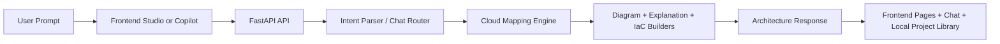

# AI Cloud Architecture Generator

A full-stack MVP that turns a plain-English product idea into a cloud architecture proposal, explanation, editable visual canvas, and optional infrastructure code starter.

## Documentation

- Product and setup overview: [README.md](/Users/kasisureshdevarajugattu/Coding/AI-Arch/README.md)
- End-to-end technical walkthrough: [docs/TECHNICAL_WALKTHROUGH.md](/Users/kasisureshdevarajugattu/Coding/AI-Arch/docs/TECHNICAL_WALKTHROUGH.md)
- Code explanation: [docs/CODE_EXPLANATION.md](/Users/kasisureshdevarajugattu/Coding/AI-Arch/docs/CODE_EXPLANATION.md)
- Accuracy and enterprise roadmap: [docs/ACCURACY_AND_ENTERPRISE_ROADMAP.md](/Users/kasisureshdevarajugattu/Coding/AI-Arch/docs/ACCURACY_AND_ENTERPRISE_ROADMAP.md)

## What It Includes

- Natural-language architecture intake
- Enterprise workload profile intake for availability, compliance, tenancy, network exposure, and environment strategy
- Deterministic intent parsing with optional OpenAI-backed or OpenAI-compatible LLM parsing
- Domain-aware classification into solution types such as web SaaS, AI platforms, AI governance, data platforms, and cybersecurity products
- Multi-cloud mapping for Azure, AWS, and GCP
- Native SVG architecture canvas with cloud imagery
- Architecture explanation and next-step guidance
- Security controls, resilience notes, operational guidance, and risk flags
- Optional Terraform starter output
- React frontend with dedicated overview, architecture, and code pages
- FastAPI backend with a single generation endpoint

## Stack

- Frontend: React, TypeScript, Vite
- Backend: FastAPI, Pydantic
- Architecture engine: domain classifier, intent parser, archetype-aware cloud mapper, native SVG canvas plus Mermaid export

## Project Layout

```text
backend/
  app/
    api/
    core/
    services/
frontend/
  src/
docs/
  TECHNICAL_WALKTHROUGH.md
```

## End-to-End Flow



## Run The Backend

```bash
python3 -m venv .venv
source .venv/bin/activate
pip install -r backend/requirements.txt
uvicorn app.main:app --reload --app-dir backend
```

The API starts on `http://localhost:8000`.

## Run The Frontend

```bash
cd frontend
npm install
npm run dev
```

The web app starts on `http://localhost:5173`.

Project routes:

- `/` marketing landing page
- `/app/studio` architecture creation workspace
- `/app/projects` saved library
- `/app/projects/:projectId/overview` project report
- `/app/projects/:projectId/architecture` visual architecture canvas
- `/app/projects/:projectId/code` infrastructure code page

## Environment Variables

Copy the example files if you want to customize local settings:

```bash
cp backend/.env.example backend/.env
cp frontend/.env.example frontend/.env
```

### Backend

- `AI_ARCHITECT_INTENT_BACKEND=heuristic` uses the built-in parser
- `AI_ARCHITECT_INTENT_BACKEND=openai` enables OpenAI parsing when `OPENAI_API_KEY` is set
- `AI_ARCHITECT_INTENT_BACKEND=llm_service` enables your OpenAI-compatible hosted LLM
- `AI_ARCHITECT_OPENAI_MODEL=gpt-4.1-mini`
- `AI_ARCHITECT_LLM_BASE_URL=https://kasdevtech-llm.onrender.com/v1`
- `AI_ARCHITECT_LLM_API_KEY=local-service`
- `AI_ARCHITECT_LLM_MODEL=qwen2.5-0.5b`
- `AI_ARCHITECT_CORS_ORIGINS=http://localhost:5173,http://127.0.0.1:5173`
- `AI_ARCHITECT_CORS_ORIGIN_REGEX=https?://.*`

### Frontend

- `VITE_API_URL=http://localhost:8000/api/v1`

## API Example

```bash
curl -X POST http://localhost:8000/api/v1/architectures/generate \
  -H "Content-Type: application/json" \
  -d '{
    "prompt": "Build a scalable web app with a frontend, backend API, relational database, authentication, and CDN.",
    "cloud": "azure",
    "include_iac": true
  }'
```

## Notes

- The MVP is intentionally deterministic after intent parsing so service mapping stays stable.
- The current UI supports enterprise-oriented inputs such as compliance targets, multi-region posture, DR, tenancy, and data sensitivity.
- The Terraform output is a starter scaffold, not production-ready infrastructure.
- The backend falls back to heuristic parsing automatically if the selected LLM backend is unavailable or returns invalid JSON.

## Deployment

### Lowest-cost Azure path

- Frontend: Azure Static Web Apps
- Backend: Azure Container Apps on consumption or a small Azure App Service plan
- Routing: `frontend/public/staticwebapp.config.json` already includes SPA fallback for nested routes
- Container image: `backend/Dockerfile` can be used for Container Apps or Web App for Containers

### Render path

- `render.yaml` is included for a simple two-service setup
- Backend: Python web service running FastAPI
- Frontend: static site serving the Vite build
- Update the Render hostnames in `render.yaml` to your final service names before deploying
