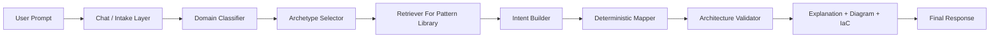

# Accuracy And Enterprise Roadmap

This document explains how to make the product more accurate, more enterprise-grade, and where ML or LLM improvements should be introduced.

## 1. Current Accuracy Strategy

The current system is intentionally hybrid:

1. prompt understanding
   - heuristic parser or LLM parser
2. normalized architecture intent
   - domain
   - archetype
   - components
3. deterministic cloud mapping
4. deterministic explanation and IaC generation

This is already better than an LLM-only generator because it constrains the output after understanding the prompt.

What is now implemented in code:

- pattern library
- lightweight retrieval/ranking over architecture packs
- lightweight local classifier over curated pattern examples
- architecture validator and confidence scoring
- matched pattern and validation findings in the final response

## 2. Why Results Can Still Be Inaccurate

Even with the current design, results can still drift for a few reasons:

### 2.1 Domain Misclassification

If the parser puts a prompt into the wrong domain, the rest of the output will also be wrong.

Example:

- a governance product gets mapped as a generic SaaS app
- an e-commerce platform gets treated too much like a data pipeline

### 2.2 Archetype Mis-selection

Even when the domain is roughly correct, the chosen solution archetype may still be too generic.

Example:

- `web_saas` is correct
- but the architecture should be `global_transaction_platform` instead of a generic enterprise app

### 2.3 Missing Required Components

The system may generate a plausible architecture without critical expected components.

Examples:

- no cache for internet-scale transactional systems
- no async messaging for order workflows
- no DR path for mission-critical systems
- no policy or discovery plane for governance products

### 2.4 Weak Validation Layer

Right now the engine builds an architecture, but it does not yet strongly score or reject weak architectures after generation.

## 3. How Hallucinations Are Currently Controlled

The product already reduces hallucinations in a few ways:

- strict enums in [models.py](/Users/kasisureshdevarajugattu/Coding/AI-Arch/backend/app/models.py)
- JSON-only prompt contracts in [prompt_templates.py](/Users/kasisureshdevarajugattu/Coding/AI-Arch/backend/app/services/prompt_templates.py)
- deterministic cloud catalogs in [mapping_engine.py](/Users/kasisureshdevarajugattu/Coding/AI-Arch/backend/app/services/mapping_engine.py)
- fallback to heuristics when LLM output is weak or unavailable in [intent_parser.py](/Users/kasisureshdevarajugattu/Coding/AI-Arch/backend/app/services/intent_parser.py)
- chat routing separated from architecture mapping in [chat_service.py](/Users/kasisureshdevarajugattu/Coding/AI-Arch/backend/app/services/chat_service.py)

That said, hallucination prevention can be improved much further.

## 4. Where ML Models Can Help

Yes, ML models can help a lot, but they should be added in the right places.

### 4.1 Best ML Use Cases

#### A. Domain Classifier

Use a small trained classifier to predict:

- `web_saas`
- `ai_platform`
- `ai_governance`
- `data_platform`
- `cybersecurity`
- `developer_platform`
- `fintech_platform`

Why:

- faster than a large LLM
- stable for repeated prompt families
- useful as a gating signal before architecture generation

#### B. Archetype Re-ranker

Given a predicted domain, use a model to rank likely archetypes.

Why:

- prevents generic fallback patterns
- improves “best-fit architecture family” selection

#### C. Architecture Quality Scorer

Use an evaluator model or trained ranker to score generated outputs.

Questions it should answer:

- is the architecture complete for this workload?
- are required enterprise components missing?
- are the services aligned with the prompt?
- are security and resilience controls sufficient?

This would be one of the most valuable additions.

#### D. Conversational Copilot Layer

LLMs are best for:

- open-ended user questions
- clarifying ambiguous prompts
- turning messy language into structured intent
- explaining tradeoffs

This is exactly where the current chat service is already moving.

## 5. Where ML Models Should Not Fully Replace Rules

Do not let the model freely own:

- final service mapping
- Terraform generation without validation
- compliance assertions
- security posture conclusions

Why:

- these are the areas where hallucinations become costly
- enterprise buyers care more about correctness than creativity

Better pattern:

- ML/LLM for understanding and ranking
- deterministic engine for final assembly

## 6. Best Accuracy Upgrade Path

### Phase 1: Better Validation

Add a post-generation validator that checks:

- required components by archetype
- expected controls by sensitivity level
- expected HA/DR posture by availability tier
- expected delivery controls for CI/CD prompts
- expected edge/cache/messaging for high-scale apps

This is the fastest accuracy win.

### Phase 2: Retrieval-Based Architecture Knowledge

Add a knowledge layer with curated architecture references:

- Azure Well-Architected
- AWS Well-Architected
- Google Cloud Architecture Framework
- internal solution pattern library
- enterprise pattern packs by domain

Then use retrieval to ground:

- domain selection
- archetype guidance
- required control expectations

This improves accuracy more safely than just “using a bigger model”.

Current state:

- a first lightweight retrieval/pattern-ranking layer is already implemented locally in code
- a small local classifier is also implemented from curated examples
- it is still curated and lightweight, not yet embedding-based or trained on real production data

### Phase 3: Domain Packs

Add explicit domain packs for:

- e-commerce
- fintech/payments
- RAG/AI apps
- AI governance
- SOC/SIEM
- healthcare systems
- internal developer platforms
- data/analytics platforms
- IoT

Each pack should define:

- typical components
- mandatory components
- optional components
- normal data flow
- normal control plane
- risk patterns

### Phase 4: Scoring And Re-ranking

After one architecture is generated:

1. generate 2-3 candidate intents
2. map each candidate deterministically
3. score them against prompt fit and architecture completeness
4. return the highest-scoring result

This can significantly improve quality.

### Phase 5: Feedback Loop

Collect human review signals:

- user edited architecture
- user regenerated due to poor fit
- accepted/rejected services
- added/removed components

Use that data to:

- retrain domain classification
- improve archetype ranking
- refine prompt templates

## 7. Concrete Enterprise Improvements

To make the product enterprise-grade, focus on these next:

### 7.1 Accuracy And Trust

- architecture validator service
- confidence score per architecture
- “why this service was chosen” traceability
- “missing expected components” warnings
- compliance mapping summary

### 7.2 Collaboration

- database-backed project persistence
- organizations and tenants
- role-based access control
- comments and approvals
- architecture version history

### 7.3 Governance

- policy packs
- architecture standards packs
- cloud guardrail libraries
- approved service catalogs by organization

### 7.4 Delivery

- stronger IaC generation
- module library integration
- export history
- deployment plan generation
- CI/CD blueprint output

### 7.5 Evaluation

- benchmark prompt suite
- golden architecture cases
- regression testing for prompt quality
- architecture completeness scoring

## 8. Recommended Target Architecture For More Accuracy

Why this is stronger:

- classification becomes explicit
- retrieval grounds the solution
- deterministic mapping controls hallucinations
- validation checks result quality before returning it

## 9. What LLM-Related Upgrades Help Most

If you want better results from LLMs specifically, prioritize:

### 9.1 Stronger Prompts

- route by domain first
- ask for structured outputs only
- forbid generic web-app fallback unless evidence supports it

### 9.2 Better Models

Your current hosted model is useful, but a stronger model would improve:

- domain understanding
- tradeoff answers
- messy prompt interpretation
- better architecture brief rewriting

### 9.3 Retrieval-Augmented Prompting

Pass in:

- relevant archetype rules
- cloud-specific reference patterns
- enterprise control expectations

This is safer than relying on the model’s memory alone.

### 9.4 Multi-Step LLM Use

Instead of one call:

1. classify problem
2. select archetype
3. build structured intent
4. validate the result

This is much more accurate than one-shot prompting.

## 10. Best Next Engineering Tasks

If the goal is “more accurate and enterprise-level”, I would prioritize this order:

1. add architecture validator service
2. add curated domain pattern library
3. add retrieval-grounded archetype prompts
4. add classifier + archetype confidence scoring
5. add project persistence/auth/versioning
6. add benchmark evaluation suite

## 11. Honest Recommendation

Do not move to an “LLM-only architect”.

Best enterprise design is:

- LLM for chat and intent understanding
- optional ML classifier for domain/archetype prediction
- deterministic mapping engine for service selection
- validation engine for accuracy scoring

That combination will give you:

- better trust
- more stable results
- faster common cases
- safer enterprise adoption
