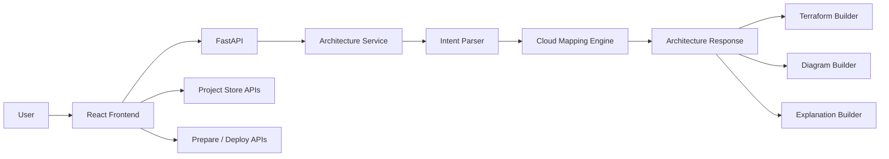

# End-to-End Code Guide

This document explains how the code works end to end, with file-level and line-oriented guidance for the main flows.

## 1. Request Flow At A Glance

## 2. Backend Entry Points

### [backend/app/main.py](../backend/app/main.py)

Important lines:

- `11-14`: create the FastAPI application
- `16-23`: apply CORS middleware
- `26-32`: root metadata endpoint
- `35-40`: health endpoint
- `43-44`: mount architecture and project routers

Why it matters:

- all backend traffic enters here
- CORS issues and health-check behavior are controlled here

### [backend/app/api/routes.py](../backend/app/api/routes.py)

Important lines:

- `23-25`: `POST /architectures/generate`
- `28-30`: `POST /architectures/rebuild`
- `33-35`: `POST /architectures/chat`
- `38-40`: `POST /architectures/deploy/azure`
- `43-45`: `POST /architectures/deploy/azure/prepare`

Pattern:

- very thin route layer
- business logic is delegated immediately to services

## 3. Core Generation Pipeline

### [backend/app/services/architecture_service.py](../backend/app/services/architecture_service.py)

Important lines:

- `20-27`: construct the orchestration service and dependencies
- `28-36`: `generate()` orchestrates normal architecture generation
- `38-65`: `rebuild()` regenerates output from edited canvas data
- `67-122`: `_build_response()` builds the final normalized architecture response
- `124-142`: `_normalize_services()` preserves stable IDs for edited services

How `generate()` works:

1. `parse()` prompt into intent
2. `map()` intent to service mappings and connections
3. `_build_response()` creates diagram, explanation, IaC, validation findings

How `rebuild()` works:

1. take edited architecture from the frontend
2. normalize service IDs
3. rebuild intent
4. rebuild connections
5. regenerate explanation, Mermaid, Terraform, and findings

### [backend/app/services/intent_parser.py](../backend/app/services/intent_parser.py)

This is one of the most important files in the repo.

Important sections:

- `29-40`: domain priority order
- `42-147`: deterministic domain override rules
- `149-253`: domain keyword signals
- `255-266`: domain-to-archetype routing
- `268-357+`: component keyword extraction

What it does:

- decides what kind of system the prompt is describing
- predicts the solution family
- extracts likely components
- enriches preferences and assumptions
- can use heuristics, OpenAI, or an OpenAI-compatible LLM service

Why this matters:

- if classification is wrong, the entire architecture will drift

### [backend/app/services/mapping_engine.py](../backend/app/services/mapping_engine.py)

Important sections:

- `16-184`: base service catalog by cloud
- `187-253`: archetype-specific overrides
- `256-261`: `map()`
- `263-281`: `_map_component()`
- `300-314`: connection building routing
- `316-360+`: default and archetype-specific connections

What it does:

- converts generic components into actual Azure/AWS/GCP services
- assigns cloud service name, category, and rationale
- builds expected service-to-service connections

This is the main anti-hallucination layer.

## 4. Validation, Patterning, And Accuracy

### [backend/app/services/architecture_classifier.py](../backend/app/services/architecture_classifier.py)

Purpose:

- lightweight local classifier using curated examples

Use:

- adds a model-style signal for domain/archetype prediction

### [backend/app/services/pattern_library.py](../backend/app/services/pattern_library.py)

Purpose:

- ranks the prompt against curated architecture packs

Use:

- retrieval-style guidance without needing a full vector database yet

### [backend/app/services/architecture_validator.py](../backend/app/services/architecture_validator.py)

Purpose:

- post-generation validation

Outputs:

- confidence score
- matched pattern
- findings and recommendations

This is important because the system does not simply generate; it also critiques its own output.

## 5. IaC And Deployment

### [backend/app/services/iac_service.py](../backend/app/services/iac_service.py)

Purpose:

- generates Terraform starter/deployable Terraform for the supported Azure subset

What it does:

- renders Terraform from architecture intent and service mappings
- acts as the source for the `Code` page

### [backend/app/services/deployment_service.py](../backend/app/services/deployment_service.py)

Important lines:

- `28-40`: supported deployable Azure component types
- `42-61`: `prepare()` returns ship plan inventory
- `63-132`: `deploy()` performs Azure login, RG create, Terraform init/plan/apply
- `134-199`: `_plan_items()` produces deploy inventory per service
- `221-258`: `_write_terraform_bundle()` writes deploy-time Terraform files
- `305-336`: `_run()` executes commands and captures logs

What happens in `Ship`:

1. frontend sends project + deployment profile
2. backend creates a deployment plan
3. backend logs in to Azure
4. backend ensures the RG exists
5. backend writes Terraform bundle into a temp directory
6. backend runs `terraform init`
7. backend runs `terraform plan`
8. backend runs `terraform apply`

Important review note:

- this works for current local/dev flows
- but long term, this should move into a safer deployment execution model

## 6. Project Persistence

### [backend/app/api/project_routes.py](../backend/app/api/project_routes.py)

Purpose:

- project CRUD, history, and restore endpoints

### [backend/app/services/project_store.py](../backend/app/services/project_store.py)

Purpose:

- backend-backed persistence
- version history
- restore support

Current storage model:

- JSON-backed store under `backend/data`

That is a good MVP step, but a real SaaS should move this to a database.

## 7. Frontend Flow

### [frontend/src/App.tsx](../frontend/src/App.tsx)

Important lines:

- `18-24`: top-level route tree
- `23-48`: app workspace routes
- `33-35`: flat project subroutes for `arch`, `code`, and `ship`
- `51`: floating copilot widget mounted globally

### [frontend/src/api.ts](../frontend/src/api.ts)

Purpose:

- single frontend API client layer

Important areas:

- `18-35`: generate architecture
- `38-54`: chat with architect
- `56-92`: deploy / prepare deploy
- `94-110`: rebuild architecture
- `112-205`: project persistence, history, canvas/deployment profile updates

### [frontend/src/context/ArchitectureStore.tsx](../frontend/src/context/ArchitectureStore.tsx)

Important lines:

- `26`: local storage key
- `59-110`: initial hydration from backend, with local fallback/import
- `128-145`: optimistic project save
- `147-156`: project delete
- `158-172`: canvas layout persistence
- `174-194`: deployment profile persistence
- `196-204`: history and restore support

This is the frontend state backbone of the app.

### [frontend/src/pages/StudioPage.tsx](../frontend/src/pages/StudioPage.tsx)

Important lines:

- `12-27`: turn existing project into editable request
- `47-84`: `handleGenerate()` creates or updates a project
- `86-237`: render studio flow, helpers, templates, and recent projects

User flow:

1. gather prompt + preferences
2. call backend generate API
3. save returned project
4. route to `/app/projects/:id/arch`

### [frontend/src/pages/ArchitectureDetailPage.tsx](../frontend/src/pages/ArchitectureDetailPage.tsx)

Important lines:

- `20`: resolve active project from store
- `22-29`: delete project flow
- `57-61`: derive `arch` / `code` / `ship` from current path
- `63-125`: render workspace header and selected subpage

This is the workspace shell for a project.

### [frontend/src/pages/ProjectOverviewPage.tsx](../frontend/src/pages/ProjectOverviewPage.tsx)

Purpose:

- main `Arch` page

Responsibilities:

- render the canvas
- manage edited services and connections
- call rebuild API
- persist history and restores

### [frontend/src/components/ArchitectureBoard.tsx](../frontend/src/components/ArchitectureBoard.tsx)

This is the most complex frontend component in the repo.

Current responsibilities:

- build SVG nodes from service mappings
- lane-based layout
- drag/reposition nodes
- export SVG/PNG/Draw.io/Visio-friendly SVG
- inline rename
- palette-based add/replace
- manual connection add/remove
- canvas inspector editing

This component is effectively a lightweight architecture editor.

### [frontend/src/components/ArchitectChatWidget.tsx](../frontend/src/components/ArchitectChatWidget.tsx)

Important lines:

- `31-43`: starter prompts
- `55-67`: widget state
- `78-126`: local persistence for chat session
- `145-204`: submit message and optionally save generated architecture
- `237-360+`: widget UI and inline architecture rendering

Copilot flow:

1. user sends message
2. widget calls chat API
3. if architecture is returned, widget saves it as a project
4. architecture preview renders directly in chat

## 8. End-to-End Summary

The repo is built around one key model:

`Prompt -> Intent -> Service Mappings -> Connections -> Diagram/Code/Deploy`

That is the central design decision that makes the product extensible.

The strongest architectural choice in the project is that it does not let the LLM own the full result. The LLM helps with understanding, while deterministic code still owns mapping, validation, and deployment preparation.
