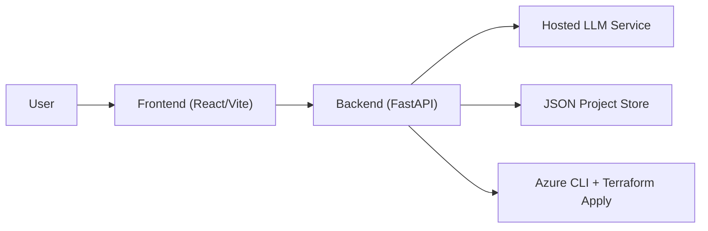
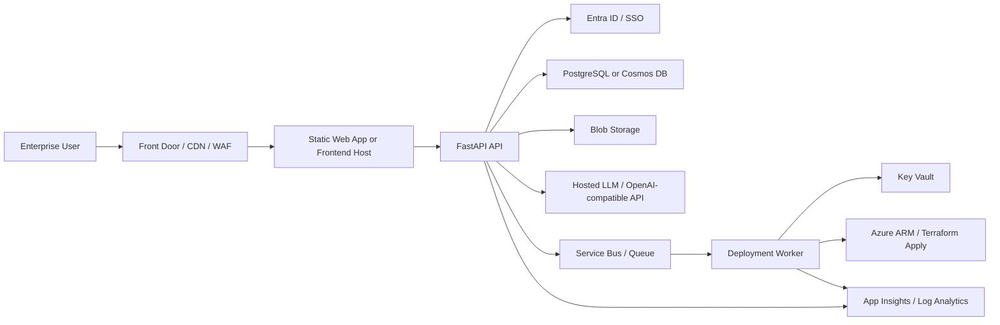
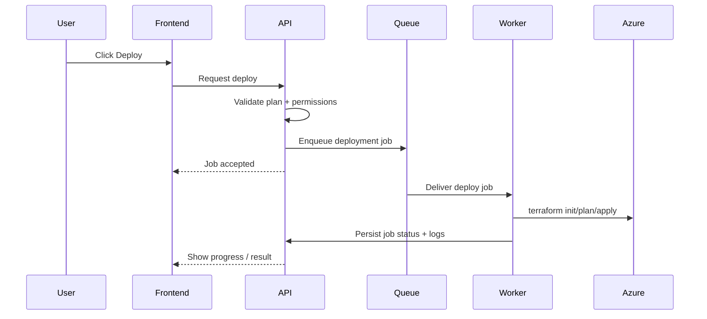

# Enterprise Deployment Architecture Review

This document reviews the deployment architecture of the product and proposes a stronger enterprise-ready target design.

## 1. Current Deployment Architecture

The current product supports:

- React/Vite frontend
- FastAPI backend
- backend-backed project storage
- hosted OpenAI-compatible LLM integration
- Terraform-first Azure deploy flow for a supported subset

### Current Runtime View

## 2. Current Strengths

- simple enough to deploy quickly
- clean separation between frontend and backend
- backend already centralizes generation, persistence, and deployment
- deploy plan preview exists before apply
- project persistence and history exist

## 3. Current Risks

### 3.1 Deployment execution is too tightly coupled to the API host

Today the backend host needs:

- Azure CLI
- Terraform
- access to user deployment credentials

That means the API service is both:

- application backend
- deployment runner

That is risky for enterprise production because blast radius is too high.

### 3.2 Credentials are too close to the frontend workflow

The current `Ship` flow accepts Azure tenant/service principal details through the product UI.

That may be okay for a dev workflow, but enterprise production usually expects:

- vault-backed secret storage
- OAuth/device code or managed identity
- approval gates
- non-frontend secret exposure

### 3.3 Persistence is not yet durable enough

The JSON-backed store is better than browser-only persistence, but it is still not enterprise storage.

Needed later:

- PostgreSQL or Cosmos DB
- row-level ownership / org partitioning
- auditing
- retention strategy

## 4. Recommended Enterprise Target Architecture

## 5. Recommended Azure Deployment Topology

### Frontend

- Azure Static Web Apps
- or App Service / Container Apps if SSR becomes necessary

### Backend

- Azure Container Apps
- or App Service if a simpler hosting model is preferred

### Persistence

- PostgreSQL Flexible Server for relational workspace metadata
- Blob Storage for exports and generated files

### Authentication

- Microsoft Entra ID
- later: org/workspace membership and RBAC tables

### Background Work

- Azure Service Bus
- deployment worker service on Container Apps Jobs or a dedicated worker app

### Secrets

- Azure Key Vault

### Observability

- Application Insights
- Log Analytics

## 6. Recommended Deployment Flow

This is better than running deployments directly in the web API process.

## 7. Enterprise Review Of The Current Code

### Good

- backend routing is already separated cleanly
- architecture generation is service-oriented
- deployment service already models `prepare` and `deploy`
- project store already introduces backend persistence and version history

### Needs Work

- deployment runner isolation
- secret handling
- real database
- auth and RBAC
- deployment job queue and status model
- stronger observability and audit logs

## 8. Recommended Next Engineering Moves

1. Replace JSON project store with a real DB
2. Add Entra-based sign-in
3. Move deployment execution into a worker or job runner
4. Store deployment secrets in Key Vault
5. Add deployment records and audit history
6. Add policy-based preflight validation before apply

## 9. Interview Review Summary

If asked “Is this enterprise-ready?” the best honest answer is:

- the generation architecture is moving in the right direction
- the project workflow is good for an advanced MVP
- the biggest enterprise gap is safe multi-user deployment and identity

That answer shows realism and good architecture judgment.
