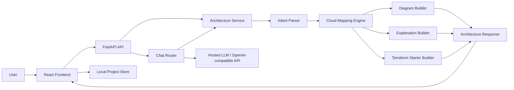
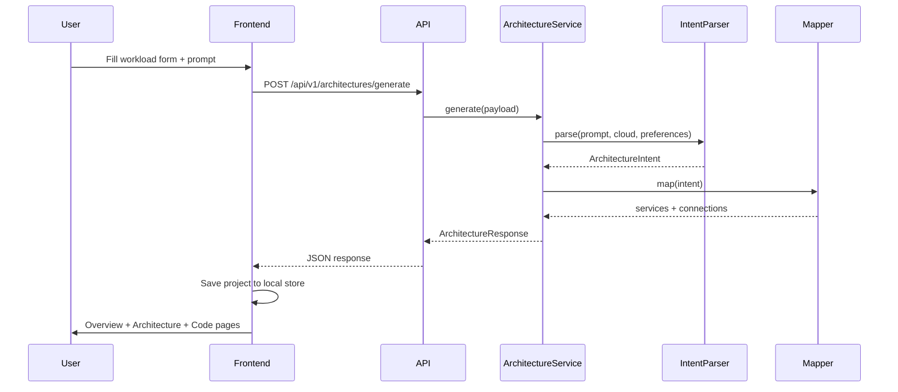
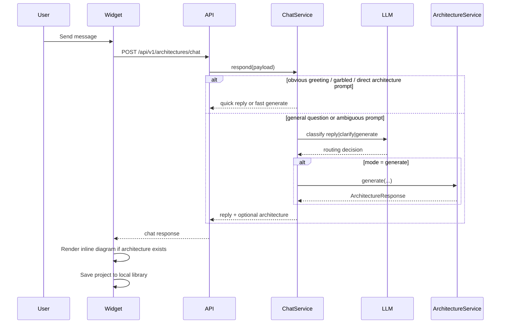

# Technical Walkthrough

This document explains how the AI Architect product works end to end, how the major modules fit together, and which implementation techniques are used across the codebase.

## 1. Product Purpose

The product turns a natural-language idea into:

- a classified solution domain and archetype
- a cloud architecture mapped to Azure, AWS, or GCP
- a visual architecture canvas
- architecture explanations and recommendations
- optional Terraform starter output
- a conversational copilot flow that can either answer questions or generate architecture

There are two main user experiences:

1. `Studio mode`
   - User fills a workload form and generates architecture directly.
2. `Copilot mode`
   - User chats naturally.
   - The assistant decides whether to answer, clarify, or generate architecture.

## 2. High-Level System Architecture

## 3. End-to-End User Flow

### 3.1 Studio Flow

### 3.2 Chat Flow

## 4. Backend Design

Backend root: [backend/app](/Users/kasisureshdevarajugattu/Coding/AI-Arch/backend/app)

### 4.1 API Layer

File: [routes.py](/Users/kasisureshdevarajugattu/Coding/AI-Arch/backend/app/api/routes.py)

Endpoints:

- `POST /api/v1/architectures/generate`
  - Generates a full architecture from a structured request.
- `POST /api/v1/architectures/chat`
  - Handles conversational copilot messages.

This layer is intentionally thin. It only validates request/response types and delegates to services.

### 4.2 Core Models

File: [models.py](/Users/kasisureshdevarajugattu/Coding/AI-Arch/backend/app/models.py)

Important model groups:

- request models
  - `ArchitectureRequest`
  - `ArchitectChatRequest`
- intent models
  - `ArchitectureIntent`
  - `ParsedComponent`
- output models
  - `ArchitectureResponse`
  - `ServiceMapping`
  - `Connection`
- enums
  - `CloudProvider`
  - `SolutionDomain`
  - `SolutionArchetype`
  - `ComponentType`

Why this matters:

- Pydantic keeps the contract explicit.
- The frontend and backend share a predictable schema.
- Domain/archetype/component enums help keep the engine deterministic after prompt understanding.

### 4.3 Architecture Service

File: [architecture_service.py](/Users/kasisureshdevarajugattu/Coding/AI-Arch/backend/app/services/architecture_service.py)

This is the orchestration layer for architecture generation.

Pipeline inside `generate()`:

1. Parse intent
2. Map components to cloud services
3. Build Mermaid representation
4. Build explanation sections
5. Build Terraform starter output
6. Validate and score the architecture
7. Return one normalized response object

This service keeps the architecture generation path composable and testable.

### 4.4 Intent Parser

File: [intent_parser.py](/Users/kasisureshdevarajugattu/Coding/AI-Arch/backend/app/services/intent_parser.py)

This is the brain for understanding what the user is asking to build.

It supports three modes:

- `heuristic`
- `openai`
- `llm_service`

Current behavior:

- common prompts can use a fast heuristic path for speed
- complex prompts can use an LLM parser
- if the LLM path fails, the system falls back to heuristics
- a lightweight pattern ranker scores the prompt against known architecture packs
- a lightweight local classifier predicts domain and archetype from curated examples
- top retrieval matches and classification confidence are carried into the final response

Important parser responsibilities:

- classify `domain`
- choose `archetype`
- infer `components`
- derive priorities, patterns, assumptions
- normalize preferences
- apply override rules for domains like:
  - AI governance
  - cybersecurity
  - fintech
  - developer platform
  - web SaaS

Why this is powerful:

- it prevents every prompt from collapsing into the same generic web app pattern
- it allows the same UI to solve different classes of architecture problems

### 4.4a Pattern Ranking Layer

Files:

- [architecture_classifier.py](/Users/kasisureshdevarajugattu/Coding/AI-Arch/backend/app/services/architecture_classifier.py)
- [pattern_library.py](/Users/kasisureshdevarajugattu/Coding/AI-Arch/backend/app/services/pattern_library.py)
- [intent_parser.py](/Users/kasisureshdevarajugattu/Coding/AI-Arch/backend/app/services/intent_parser.py)

This is a lightweight local ranking and classification layer.

What it does:

- scores the prompt against curated architecture packs
- classifies prompt family from curated examples
- returns the closest pattern matches
- boosts domain and archetype selection
- improves confidence scoring

It is not a large trained production ML system yet, but it is now a genuine local model layer in the product.

### 4.5 Cloud Mapping Engine

File: [mapping_engine.py](/Users/kasisureshdevarajugattu/Coding/AI-Arch/backend/app/services/mapping_engine.py)

This layer converts generic components into real cloud services.

Core technique:

- generic component -> cloud-specific service catalog entry

Examples:

- `frontend` -> `Azure Static Web Apps`
- `queue` -> `Azure Service Bus`
- `policy_engine` -> `Azure Policy`

The mapper contains:

- base service catalog per cloud
- archetype-specific overrides
- connection building logic

Why this is important:

- LLMs are useful for intent understanding
- deterministic mapping is safer for architecture output
- it produces stable results and reduces hallucinations

### 4.6 Diagram Builder

File: [diagram_service.py](/Users/kasisureshdevarajugattu/Coding/AI-Arch/backend/app/services/diagram_service.py)

The backend generates Mermaid text as one output format, even though the main UI uses a native SVG-style canvas on the frontend.

Why Mermaid still exists:

- export/debug value
- portable textual representation
- easy future interoperability

### 4.7 Explanation Builder

File: [explanation_service.py](/Users/kasisureshdevarajugattu/Coding/AI-Arch/backend/app/services/explanation_service.py)

This service builds:

- explanation sections
- topology highlights
- security controls
- resilience notes
- operational controls
- risk flags
- recommended next steps

This turns the output from “diagram only” into “architect-ready deliverable”.

### 4.7a Architecture Validator

File: [architecture_validator.py](/Users/kasisureshdevarajugattu/Coding/AI-Arch/backend/app/services/architecture_validator.py)

This service scores the architecture after generation.

Outputs:

- confidence score
- matched pattern
- validation findings

Examples of checks:

- missing expected components for a known pattern
- missing secrets management for sensitive workloads
- missing edge layer for multi-region/global prompts
- missing queue/cache for traffic-heavy transactional systems

### 4.8 Terraform Starter Builder

File: [iac_service.py](/Users/kasisureshdevarajugattu/Coding/AI-Arch/backend/app/services/iac_service.py)

This produces a starter Terraform scaffold based on the mapped services.

Important note:

- it is intentionally a starter, not production-grade IaC
- it is designed to help users move from architecture idea to implementation direction

### 4.9 Conversational Copilot

File: [chat_service.py](/Users/kasisureshdevarajugattu/Coding/AI-Arch/backend/app/services/chat_service.py)

The chat flow is now LLM-first, with fallback safety.

Core modes:

- `reply`
- `clarify`
- `generate`

Important implementation details:

- greetings and obvious garbled input are fast-pathed
- clear architecture prompts are fast-pathed into generation
- general questions can be answered conversationally
- architecture generation still routes into `ArchitectureService`

This gives the product a ChatGPT-like experience while keeping architecture generation deterministic.

### 4.10 Prompt Templates

File: [prompt_templates.py](/Users/kasisureshdevarajugattu/Coding/AI-Arch/backend/app/services/prompt_templates.py)

Prompt templates define the system behavior for:

- intent parsing
- chat assistant behavior
- chat routing

Technique used:

- strict JSON prompt contracts for machine-readable outputs
- concise instruction prompts for normal chat replies

## 5. Frontend Design

Frontend root: [frontend/src](/Users/kasisureshdevarajugattu/Coding/AI-Arch/frontend/src)

### 5.1 App Routing

File: [App.tsx](/Users/kasisureshdevarajugattu/Coding/AI-Arch/frontend/src/App.tsx)

Main routes:

- `/`
- `/app/studio`
- `/app/projects`
- `/app/projects/:projectId/overview`
- `/app/projects/:projectId/architecture`
- `/app/projects/:projectId/code`

Global UI:

- `ArchitectChatWidget` is mounted at the app root so the copilot is always available

### 5.2 Architecture Composer

File: [ArchitectureComposer.tsx](/Users/kasisureshdevarajugattu/Coding/AI-Arch/frontend/src/components/ArchitectureComposer.tsx)

This is the main architecture intake form.

It captures:

- workload prompt
- cloud target
- tenancy
- environments
- availability
- sensitivity
- network exposure
- compliance frameworks
- multi-region
- DR
- IaC preference

Technique used:

- controlled React form state
- reusable preference update helpers
- quick prompt shortcuts

### 5.3 Local Project Store

File: [ArchitectureStore.tsx](/Users/kasisureshdevarajugattu/Coding/AI-Arch/frontend/src/context/ArchitectureStore.tsx)

Current persistence is browser-local.

It stores:

- generated projects
- updated canvas layouts

Why it exists:

- quick MVP persistence
- no backend database needed yet
- saved architecture browsing/editing feels SaaS-like

Important limitation:

- projects are not shared across devices/users yet

### 5.4 Architecture Board

File: [ArchitectureBoard.tsx](/Users/kasisureshdevarajugattu/Coding/AI-Arch/frontend/src/components/ArchitectureBoard.tsx)

This is the primary diagram renderer used in the product UI.

Key behaviors:

- native SVG-style canvas rendering
- cloud-specific imagery
- archetype-aware lanes
- drag-and-drop node repositioning
- canvas layout persistence
- read-only and editable modes

Why this matters:

- it gives a more productized feel than raw Mermaid
- it supports enterprise-style staged diagrams
- it allows future export/editing workflows

### 5.5 Project Pages

Important files:

- [ArchitectureDetailPage.tsx](/Users/kasisureshdevarajugattu/Coding/AI-Arch/frontend/src/pages/ArchitectureDetailPage.tsx)
- [ProjectOverviewPage.tsx](/Users/kasisureshdevarajugattu/Coding/AI-Arch/frontend/src/pages/ProjectOverviewPage.tsx)
- [ProjectArchitecturePage.tsx](/Users/kasisureshdevarajugattu/Coding/AI-Arch/frontend/src/pages/ProjectArchitecturePage.tsx)
- [ProjectTerraformPage.tsx](/Users/kasisureshdevarajugattu/Coding/AI-Arch/frontend/src/pages/ProjectTerraformPage.tsx)

These pages break one generated architecture into:

- overview/reporting
- architecture canvas
- code/IaC

This separation is what makes the app feel more like a SaaS product and less like a single-page demo.

### 5.6 Floating Copilot Widget

File: [ArchitectChatWidget.tsx](/Users/kasisureshdevarajugattu/Coding/AI-Arch/frontend/src/components/ArchitectChatWidget.tsx)

This widget:

- keeps chat available everywhere
- persists chat thread locally
- renders generated architecture inline inside the conversation
- saves generated architectures to the project library

Technique used:

- localStorage-backed session persistence
- optimistic local thread updates
- Enter-to-send interaction
- inline architecture rendering using the same board component

### 5.7 Styling Strategy

File: [index.css](/Users/kasisureshdevarajugattu/Coding/AI-Arch/frontend/src/index.css)

The frontend uses:

- one shared design token layer in CSS variables
- dark enterprise product styling
- reusable panel/card/button primitives
- responsive layout breakpoints

## 6. Core Techniques Used

### 6.1 Hybrid AI + Deterministic Architecture Engine

The system is intentionally not “LLM-only”.

Pattern used:

1. LLM or heuristics understand intent
2. deterministic engine maps to services
3. deterministic renderer builds output structures

Why:

- better reliability
- less service hallucination
- more stable output quality

### 6.2 Domain + Archetype Routing

Instead of one generic web-app generator, the engine first decides:

- what domain the prompt belongs to
- which solution archetype best fits that domain

This is the main reason the system can generate different styles of architectures for:

- e-commerce
- AI governance
- developer platform
- fintech
- data processing
- AI apps

### 6.3 Fast Paths for UX

Used in both parser and chat:

- obvious nonsense -> fast clarify
- clear greetings -> fast reply
- obvious architecture prompts -> fast generate
- common application prompts -> fast heuristic parsing

Why:

- reduces dependence on a slow hosted model for simple cases
- makes the copilot feel responsive

### 6.4 Shared Output Contract

Everything converges into `ArchitectureResponse`.

That single response shape powers:

- overview page
- canvas page
- code page
- chat inline rendering
- local project persistence

### 6.5 Multi-Cloud Catalog Mapping

The mapping engine uses a portable component model and then switches cloud catalogs underneath it.

That allows one prompt model to work across:

- Azure
- AWS
- GCP

## 7. Current Limitations

This product is a strong advanced MVP, but not enterprise-complete yet.

Known gaps:

- project persistence is localStorage-only
- no database-backed project workspace yet
- no authentication or RBAC
- no shared teams/organizations
- no project approval/version workflow
- Terraform output is starter-level
- some icon coverage and layout tuning can still improve

## 8. Recommended Next Technical Steps

1. Add database-backed projects and users
2. Add authentication and tenant boundaries
3. Add version history and approvals
4. Add background export pipeline for PNG/SVG/Draw.io artifacts
5. Add tests for intent parsing, mapping, and chat routing
6. Add more archetype packs for additional domains

## 9. File Guide

If you want to read the code in the most useful order, start here:

1. [README.md](/Users/kasisureshdevarajugattu/Coding/AI-Arch/README.md)
2. [models.py](/Users/kasisureshdevarajugattu/Coding/AI-Arch/backend/app/models.py)
3. [architecture_service.py](/Users/kasisureshdevarajugattu/Coding/AI-Arch/backend/app/services/architecture_service.py)
4. [intent_parser.py](/Users/kasisureshdevarajugattu/Coding/AI-Arch/backend/app/services/intent_parser.py)
5. [mapping_engine.py](/Users/kasisureshdevarajugattu/Coding/AI-Arch/backend/app/services/mapping_engine.py)
6. [chat_service.py](/Users/kasisureshdevarajugattu/Coding/AI-Arch/backend/app/services/chat_service.py)
7. [App.tsx](/Users/kasisureshdevarajugattu/Coding/AI-Arch/frontend/src/App.tsx)
8. [ArchitectureComposer.tsx](/Users/kasisureshdevarajugattu/Coding/AI-Arch/frontend/src/components/ArchitectureComposer.tsx)
9. [ArchitectureBoard.tsx](/Users/kasisureshdevarajugattu/Coding/AI-Arch/frontend/src/components/ArchitectureBoard.tsx)
10. [ArchitectChatWidget.tsx](/Users/kasisureshdevarajugattu/Coding/AI-Arch/frontend/src/components/ArchitectChatWidget.tsx)
